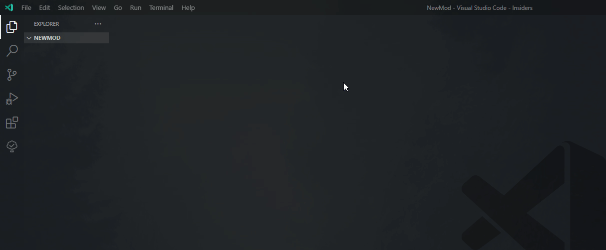

## Need help? See a mistake? Tag Wrath in the zero sievert discord.

# Using the plugin
Add the extension from the [VSCode extension marketplace](https://marketplace.visualstudio.com/items?itemName=wrathdoesthat.zsmoddingtools)

# Compiling the generator
If you want to mess with the generator itself you will need the [Odin compiler](https://github.com/odin-lang/Odin)\
The command i use to compile odin build . -vet -strict-style

# Features
NOTE: this is not an lsp you will not get hover/diagnostics only name autofilling and syntax highlighting.
## Syntax highlighting for the catspeak programming language
(Previews with the default VSCode theme)

Without\

With\

## Snippets for the API functions

## Helpful commands
