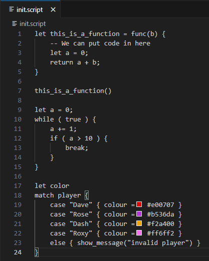
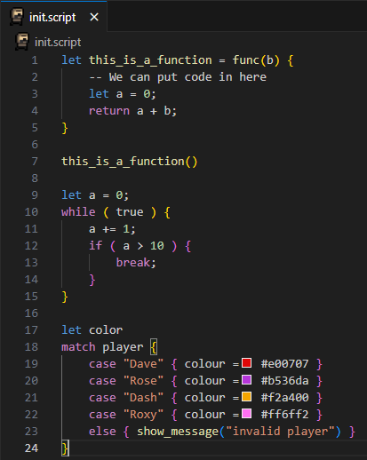
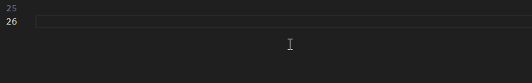

## Need help? See a mistake? Tag Wrath in the zero sievert discord.

# Using the plugin
In order to use the zero sievert modding tools extension simply move the extension into your [VSCode extension directory](https://code.visualstudio.com/docs/configure/extensions/extension-marketplace#_where-are-extensions-installed) (make sure it is unzipped) the version i am distributing in releases is the no asset snippets version

# Compiling the generator
If you want to mess with the generator itself you will need the [Odin compiler](https://github.com/odin-lang/Odin)\
The command i use to compile odin build . -vet -strict-style

# Features
## Syntax highlighting for the catspeak programming language
(Previews with the default VSCode theme)\

Without\

With\

## Snippets for the API functions
